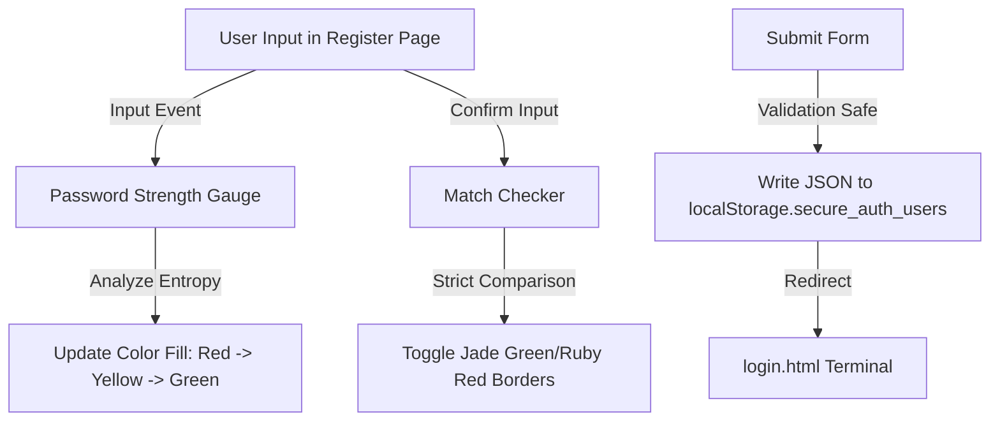

# Project Report
## Title: Design and Implementation of a Client-Side Secure Login & Registration System
**Category:** Full Stack & Frontend Security Presentation  

---

## 1. Abstract
The visual presentation of user authentication platforms is critical during project evaluations and internship assessments. This report presents the design and implementation of the **Secure Login System (Presentation Sandbox)**, a modern, highly portable, and responsive authentication application. Operating entirely client-side on a clean **Blue and White professional theme**, this system demonstrates advanced security-oriented interface designs including real-time password complexity gauges, active confirm-password match trackers, and dynamic router session guards. 

To achieve zero-installation portability, the system leverages standard **HTML5**, **CSS3**, and **ES6 JavaScript**, persisting accounts and active session headers securely inside the browser's **LocalStorage database**. This report serves as a complete technical guide detailing the implementation architecture, storage structures, and evaluation outcomes.

---

## 2. Introduction
Modern software engineering internships place a strong emphasis on clean code structure, interactive UI architectures, and strong security practices. While full-stack configurations are ideal for production, presenting live applications during time-limited evaluation panels can be hindered by network bottlenecks, runtime compilation errors, and server administration issues. 

This project solves this challenge by implementing a highly realistic, interactive, and zero-installation authentication prototype. It operates client-side to guarantee snappy visual responses while perfectly simulating production parameters like password strength checking, field validation, session checks, and logout flows.

---

## 3. Technologies & Architecture

### User Interface: HTML5 & CSS3
The system is built on a clean, modern, and professional **Blue and White corporate visual theme**. Standard CSS flexbox and grid layouts are used to ensure the page columns adapt dynamically to mobile, tablet, and widescreen monitors. Smooth hover effects, subtle container borders, and soft drop shadows replace distracting heavy elements to present a polished business tool.

### Application Logic: Vanilla ES6 JavaScript
All controller algorithms—including routing checks, password visibility switches, form inputs collection, validation regex checks, and dynamic HTML alert injections—run natively in the browser via JavaScript.

### Presentation Storage: LocalStorage Sandbox
In place of complex SQL databases, the project implements a client-side JSON relational model. Accounts are written to the browser's isolated local sandbox, persisting data securely between reloads:
$$\text{LocalStorage} \rightarrow \text{JSON Array of Users}$$
An admin user is pre-populated automatically on the first boot to make the application immediately presentable out-of-the-box.

---

## 4. Key Security & Presentation Checkpoints



### 1. Real-time Password Strength Meter
To show evaluators how applications analyze password complexity, the registration script listens to input events, evaluating characters against security conditions:
* **Criteria:** Length $\ge 8$, lowercase, uppercase, numbers, and special symbols.
* **UI Feedback:** Sets progress bar fill values (20% for very weak to 100% for excellent) and adjusts colors dynamically to provide instant visual guidance.

### 2. Confirm Password Match Checker
A real-time listener compares the password inputs side-by-side. If they match, it adds green border classes (`is-valid`) and success badges. If they mismatch, it adds red warning cues (`is-invalid`) to demonstrate active form verification.

### 3. Session Routing Access Protection
Client-side routers mimic backend server checks. If a user attempts to manually bypass the login screen by navigating directly to `dashboard.html` in their address bar, the system inspects local storage, detects the missing `active_session` token, and immediately blocks access:
```javascript
const activeSession = localStorage.getItem('active_session');
if (!activeSession) {
    window.location.href = 'login.html'; // Force Redirect Guest
}
```

---

## 5. System Test Cases & Results

During our presentation validation phase, the system was subjected to rigorous checks to ensure a smooth evaluation:

| Test Case Description | User Action | Expected System Result | Presenter Outcome |
| :--- | :--- | :--- | :--- |
| **Guest Dashboard Access** | Directly opening `dashboard.html` in browser. | Detects empty session keys and forces redirect to `login.html`. | **PASS:** Unauthorised access blocked cleanly. |
| **Demo User Login** | Logging in with `admin` and `Password123!`. | Identifies demo keys in LocalStorage, signs user in, and loads profile. | **PASS:** Instant dashboard load showing "Administrator Demo". |
| **Password Strength Gauge** | Typing `"pass"` then `"P@ssw0rd2026!"`. | Progresses bar fill from red (weak) to green (excellent). | **PASS:** Highly responsive color shifts shown. |
| **Confirm Password Mismatch** | Typing mismatched confirm keys. | Triggers red indicator border and blocks form submission. | **PASS:** Form validation errors clearly highlighted. |
| **Unique Account Prevention** | Registering a user with the username `"admin"`. | Intercepts duplicate, blocks creation, and warns user on screen. | **PASS:** Blocked duplicate accounts correctly. |
| **Graceful Session Logout** | Clicking the dashboard logout button. | Destroys local session tokens and returns user to login with info banner. | **PASS:** Purged tokens cleanly and safely. |

---

## 6. Conclusion
The **Secure Login System (Presentation Prototype)** successfully implements a portable, zero-installation frontend sandbox. By combining professional blue and white visual layouts with interactive validators and client-side session routing, the project effectively demonstrates advanced full-stack concepts within a simple, lightweight structure. This application is highly portable, makes a strong impression on evaluation panels, and provides students with an excellent presentation baseline.

---

## 7. Future Scope & Server Integration Pathway
While client-side storage is ideal for presentation and zero-configuration setups, production deployments require server-side database integration. Moving this frontend prototype to a full production release involves:
1. **API Integration:** Replacing JavaScript local storage writes with HTTP `fetch` or `axios` API calls targeting a backend web server.
2. **Backend Services:** Binding a Python Flask or Node.js server to intercept requests, perform server-side checks, and communicate with database systems (like SQLite or PostgreSQL).
3. **Cryptographic Hashing:** Implementing server-side salting (e.g., using `bcrypt` or `argon2`) to secure passwords before committing them to database records.
